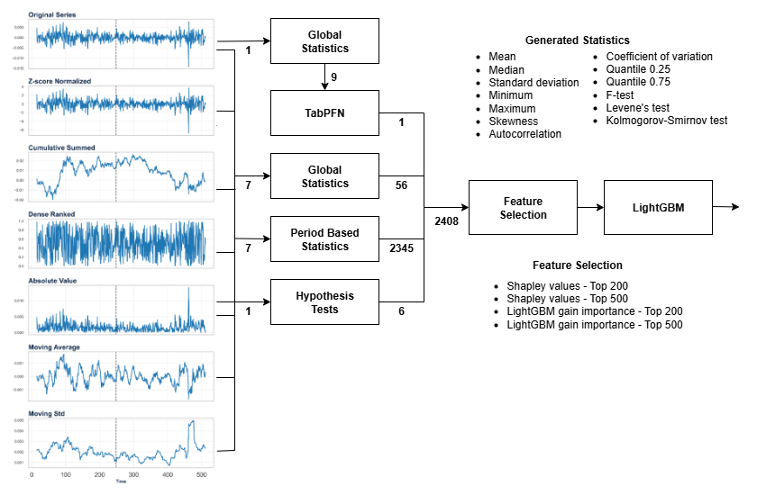

# ADIA Lab Structural Break Challenge Solution

This repository contains the solution for the [ADIA Lab Structural Break Challenge](https://hub.crunchdao.com/competitions/structural-break). The goal of the competition was to detect structural breaks in time series data. This solution uses a supervised learning approach, building a robust pipeline for feature engineering, feature selection, and modeling to predict the likelihood of a structural break at a given point in a time series.

## Competition Overview

The task of this competition is structural break detection: your goal is to determine whether a structural break has occurred or not at a specified point in each time series you will be given. To help you in this endeavor, we provide a large number of example time series together with their corresponding labels so that you can calibrate your detection methods, or train your prediction models if you prefer a supervised approach. Your detection algorithm has to be designed to take as input a time series and output the likelihood (a score between 0 and 1) of a structural break.

This problem holds significant relevance in fields such as:

* **Climatology**, where identifying shifts in weather patterns can signal climate anomalies or long-term climate change.
* **Industrial settings**, where detecting structural breaks in machinery sensor data can preemptively indicate equipment failures or maintenance needs.
* **Finance**, where recognizing structural breaks in market data is crucial for modeling asset prices and managing financial risks.
* **Healthcare monitoring systems**, where sudden changes in physiological signals may reflect critical health events requiring immediate attention.

## Our Approach

The solution is a pipeline that transforms the raw time series data into a rich feature set and then uses a LightGBM model to make predictions. The overall workflow is illustrated in the diagram below:



The key stages of our approach are:

### 1. Time Series Transformations

To capture a wide range of patterns in the time series, we first apply a variety of transformations to the original series. These transformations help to highlight different patterns of the data. The transformations used are:

* Z-score Normalization
* Cumulative Sum
* Dense Ranking
* Absolute Value
* Moving Average
* Moving Standard Deviation

### 2. Feature Engineering

From the original and transformed time series, a large number of features are generated. This is the most critical part of the pipeline. The generated features fall into several categories:

* **Statistical Features:** A set of descriptive statistics are calculated for the series and its transformations, both globally (for the entire series) and for different periods. These include:
    * Mean
    * Median
    * Standard deviation
    * Minimum
    * Maximum
    * Skewness
    * Autocorrelation
    * Coefficient of variation
    * Quantile 0.25
    * Quantile 0.75
* **Hypothesis Tests:** Statistical hypothesis tests are performed to compare the distributions of different parts of the time series. The features generated are based on:
    * F-test
    * Levene's test
    * Kolmogorov-Smirnov test
* **TabPFN Features:** We use the Tabular Prior-data Fitted Network (TabPFN) to generate an additional feature based on its predictive capabilities.

In total, this stage generates **2408 features**.

### 3. Feature Selection

With a large number of generated features, feature selection is crucial to reduce dimensionality, prevent overfitting, and improve model performance. We use a two-stage feature selection process:

1.  **Shapley Values:** We use SHAP (SHapley Additive exPlanations) to calculate the importance of each feature. We select the **Top 200** and **Top 500** features based on their Shapley values from different models.
2.  **LightGBM Gain Importance:** We also use the feature importance calculated by a LightGBM model (based on gain). The **Top 500** features are selected using this method.

The selected features from these methods are then combined to form the final feature set for the model.

### 4. Modeling with LightGBM

The final step is to train a LightGBM model on the selected features. LightGBM is a gradient boosting framework that is known for its high performance and efficiency. The model is trained to predict the probability of a structural break.

## How to Run the Code

The entire pipeline is implemented in the `submission.ipynb` Jupyter Notebook. To run the code, you will need to have a Python environment with the necessary dependencies installed. Then, you can open the notebook and run the cells in order.

The notebook is structured as follows:

1.  **Setup and Data Loading:** Installs and imports necessary libraries and loads the training and test data.
2.  **Feature Engineering:** Contains the code for all the time series transformations and feature generation methods.
3.  **Feature Selection:** Implements the feature selection process using Shapley values and LightGBM importance.
4.  **Model Training and Prediction:** Trains the final LightGBM model and generates predictions for the test set.

## Dependencies

The main dependencies for this project are:

* `numpy`
* `pandas`
* `scipy`
* `scikit-learn`
* `lightgbm`
* `shap`
* `tabpfn`

You can install these dependencies using pip:

```bash
pip install numpy pandas scipy scikit-learn lightgbm shap tabpfn
```
